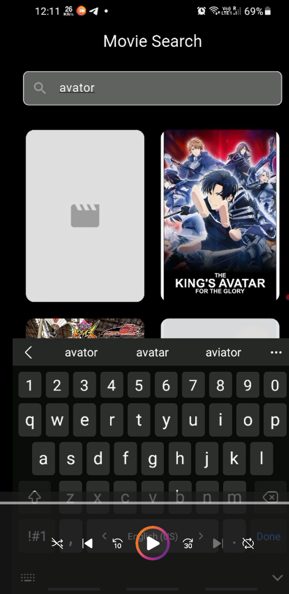

# Flutter Movie Search App

A modern, responsive Flutter application for searching movies and TV shows using the TMDb API. Built with BLoC state management and Material Design principles.

## Features

*   **Movie & TV Show Search**: Real-time search with debouncing
*   **Responsive Design**: Optimized for phones and tablets (portrait & landscape)
*   **BLoC State Management**: Clean architecture with flutter\_bloc
*   **Detailed Movie View**: Rich movie information with high-quality images
*   **Error Handling**: Comprehensive error states with retry functionality
*   **Image Caching**: Efficient network image loading and caching
*   **Modern UI**: Material Design 3 with smooth animations

## Demo Video

| Search Screen | Movie Details | Responsive Grid |
| --- | --- | --- |
|  | Coming soon | Coming soon |

## Getting Started

### Prerequisites

*   Flutter SDK (>=3.0.0)
*   Dart SDK (>=3.0.0)
*   Android Studio / VS Code
*   TMDb API Key

### Installation

1.  **Clone the repository**
    
        git clone https://github.com/yourusername/movie_search_app.git
        cd movie_search_app
        
    
2.  **Install dependencies**
    
        flutter pub get
        
    
3.  **Get TMDb API Key**
    
    *   Visit [TMDb API](https://www.themoviedb.org/settings/api)
    *   Create an account and request an API key (free)
    *   Copy your API key
4.  **Configure API Key**
    
    *   Open `lib/services/movie_service.dart`
    *   Replace `YOUR_TMDB_API_KEY_HERE` with your actual API key:
    
        static const String _apiKey = 'your_actual_api_key_here';
        
    
5.  **Run the app**
    
        flutter run
        
    

## Project Structure

    lib/
    ├── main.dart                    # App entry point
    ├── models/
    │   └── movie.dart              # Movie data model
    ├── services/
    │   └── movie_service.dart      # TMDb API service
    ├── blocs/                      # BLoC state management
    │   ├── movie_bloc.dart
    │   ├── movie_event.dart
    │   └── movie_state.dart
    ├── screens/                    # Main app screens
    │   ├── search_screen.dart
    │   └── movie_detail_screen.dart
    └── widgets/                    # Reusable UI components
        ├── movie_grid.dart
        ├── movie_card.dart
        └── search_bar_widget.dart
    

## Architecture

### BLoC Pattern

The app follows the BLoC (Business Logic Component) pattern for state management:

*   **Events**: User actions (SearchMovies, ClearSearch, RetrySearch)
*   **States**: Application states (Loading, Loaded, Error, Empty, Initial)
*   **Bloc**: Business logic layer that processes events and emits states

### Responsive Design

The UI adapts to different screen sizes:

*   **Phone (< 600px)**: 2-column grid
*   **Small Tablet (600-900px)**: 3-column grid
*   **Large Tablet (> 900px)**: 4-column grid

## Dependencies

### Core Dependencies

    flutter_bloc: ^8.1.3          # State management
    http: ^1.1.0                  # HTTP client for API calls
    cached_network_image: ^3.3.0  # Image caching
    equatable: ^2.0.5             # Value equality
    

### Why These Dependencies?

*   **flutter\_bloc**: Industry standard for Flutter state management
*   **http**: Simple and reliable HTTP client
*   **cached\_network\_image**: Handles network images with automatic caching
*   **equatable**: Simplifies state comparison in BLoC

## API Integration

### TMDb API Endpoints

*   **Search**: `GET /search/multi`
*   **Base URL**: `https://api.themoviedb.org/3`
*   **Image Base**: `https://image.tmdb.org/t/p/`

### Error Handling

*   Network connectivity issues
*   Invalid API key (401)
*   No results found (404)
*   Request timeouts
*   Server errors (5xx)

## Key Features Implementation

### 1\. Debounced Search

    Timer(const Duration(milliseconds: 500), () {
      if (query.isNotEmpty) {
        widget.onSearch(query);
      }
    });
    

### 2\. Responsive Grid Layout

    int crossAxisCount = constraints.maxWidth < 600 ? 2 :
                        constraints.maxWidth < 900 ? 3 : 4;
    

### 3\. State Management Flow

    User Input → SearchMovies Event → API Call → State Update → UI Rebuild
    

## Testing

### Manual Testing

1.  **Search Functionality**
    
    *   Search for "Avengers", "Batman", "Star Wars"
    *   Test empty search results
    *   Verify debouncing behavior
2.  **Responsive Design**
    
    *   Test on different screen sizes
    *   Rotate device to test landscape mode
    *   Check tablet layouts
3.  **Error Handling**
    
    *   Turn off internet connection
    *   Use invalid API key
    *   Test retry functionality

### Running Tests

    flutter test
    

## Performance Optimizations

### Image Loading

*   Lazy loading of movie posters
*   Automatic image caching
*   Placeholder and error widgets
*   Optimized image sizes (w500 for posters, w780 for backdrops)

### API Efficiency

*   Debounced search (500ms delay)
*   Single page results
*   10-second request timeout
*   Proper error handling

### Memory Management

*   Automatic disposal of controllers and timers
*   Efficient widget rebuilds
*   Cached network images

## Contributing

1.  Fork the project
2.  Create your feature branch (`git checkout -b feature/AmazingFeature`)
3.  Commit your changes (`git commit -m 'Add some AmazingFeature'`)
4.  Push to the branch (`git push origin feature/AmazingFeature`)
5.  Open a Pull Request

### Code Style

*   Follow Flutter/Dart style guide
*   Use meaningful variable names
*   Add comments for complex logic
*   Keep functions small and focused

## Troubleshooting

### Common Issues

**App won't load movies**

*   Verify your TMDb API key is correct
*   Check internet connection
*   Ensure API key has necessary permissions

**Build errors**

*   Run `flutter clean && flutter pub get`
*   Check Flutter version compatibility
*   Verify all dependencies are properly installed

**UI not responsive**

*   Test on different screen sizes
*   Check LayoutBuilder implementation
*   Verify MediaQuery usage

## Future Enhancements

*   \[ \] Favorites/Watchlist functionality
*   \[ \] Genre filtering
*   \[ \] Movie trailers integration
*   \[ \] Offline mode with local storage
*   \[ \] User reviews and ratings
*   \[ \] Advanced search filters
*   \[ \] Dark theme support
*   \[ \] Internationalization (i18n)

## License

This project is licensed under the MIT License - see the [LICENSE](https://claude.ai/chat/LICENSE) file for details.

## Acknowledgments

*   [TMDb API](https://www.themoviedb.org/documentation/api) for movie data
*   [Flutter](https://flutter.dev/) for the amazing framework
*   [BLoC Library](https://bloclibrary.dev/) for state management
*   Material Design for UI guidelines

## Contact

Your Name - shriyansk133@gmail.com

Project Link: [https://github.com/yourusername/movie_search_app](https://github.com/shriyanshkush/GlowbalWorkAssignment)

* * *

**Built with ❤️ using Flutter**
